# react-ai-stream

[](https://github.com/trimooo/react-ai-stream/actions/workflows/ci.yml)
[](https://www.npmjs.com/package/@react-ai-stream/core)
[](https://www.npmjs.com/package/@react-ai-stream/react)
[](https://www.npmjs.com/package/@react-ai-stream/ui)
[](https://www.npmjs.com/package/@react-ai-stream/vue)
[](https://www.npmjs.com/package/@react-ai-stream/express)
[](https://www.npmjs.com/package/@react-ai-stream/react)
[](https://bundlephobia.com/package/@react-ai-stream/react)
[](https://github.com/trimooo/react-ai-stream/blob/master/LICENSE)
[](https://react-ai-stream-docs.vercel.app/)
[](https://react-ai-stream-example.vercel.app)
[](rais-spec/COMPLIANCE.md)

**Universal AI streaming infrastructure.** One wire protocol. Any server. Any client framework.

The **RAIS Protocol** (React AI Stream) is a minimal three-event SSE standard for streaming AI responses from any backend to any frontend. This monorepo ships everything you need to implement it: a React hook, Vue composable, Express middleware, Python helper, DevTools panel, and a scaffolding CLI.

```
┌──────────────────────────────────────────────────────────────────────┐
│                         RAIS Protocol v1                             │
│               data: {"type":"text","text":"..."}                     │
│               data: {"type":"done"}                                  │
│               data: {"type":"error","error":"..."}                   │
└────────────────────────────────┬─────────────────────────────────────┘
                                 │  SSE  (WebSocket optional)
              ┌──────────────────┼──────────────────┐
              ▼                  ▼                  ▼
         React hook          Vue composable     Any HTTP client
         useAIChat()         useAIChat()        fetch / curl / ...
```

---

## The Ecosystem

### Official frontend clients

| Package | Install | Description |
|---------|---------|-------------|
| [`@react-ai-stream/react`](https://www.npmjs.com/package/@react-ai-stream/react) | `npm i @react-ai-stream/react` | **Official React** — `useAIChat` hook, messages, loading, abort, error |
| [`@react-ai-stream/ui`](https://www.npmjs.com/package/@react-ai-stream/ui) | `npm i @react-ai-stream/ui` | **Official React UI** — `<Chat>`, `<MessageList>`, `<MarkdownRenderer>` |
| [`@react-ai-stream/vue`](https://www.npmjs.com/package/@react-ai-stream/vue) | `npm i @react-ai-stream/vue` | **Official Vue 3** — `useAIChat` composable, identical API surface |

### Official server adapters

| Package | Install | Description |
|---------|---------|-------------|
| [`@react-ai-stream/express`](https://www.npmjs.com/package/@react-ai-stream/express) | `npm i @react-ai-stream/express` | **Official Express** — `raisMiddleware()`, one-line RAIS streaming |
| [`rais`](https://www.npmjs.com/package/rais) | `pip install rais` | **Official Python** — `stream_response()` async generator, FastAPI / Starlette |

### Tooling

| Package | Install | Description |
|---------|---------|-------------|
| [`@react-ai-stream/core`](https://www.npmjs.com/package/@react-ai-stream/core) | `npm i @react-ai-stream/core` | SSE parser, chunk normalizer, Zustand store, abort utils |
| [`@react-ai-stream/devtools`](https://www.npmjs.com/package/@react-ai-stream/devtools) | `npm i -D @react-ai-stream/devtools` | Floating DevTools panel — live token log, timing, tok/s |
| [`rais-server`](https://www.npmjs.com/package/rais-server) | `npx rais-server` | Reference server CLI — instant RAIS endpoint from any API key |
| [`rais-compliance`](https://www.npmjs.com/package/rais-compliance) | `npx rais-compliance` | Compliance test runner + mock server |
| [`create-ai-stream-app`](https://www.npmjs.com/package/create-ai-stream-app) | `npx create-ai-stream-app` | Scaffolding CLI — generates a working Next.js + RAIS app |

> **RAIS v1 is frozen.** Backward compatibility is guaranteed forever. Streams built on RAIS v1 today will work with every future RAIS client. See [`rais-spec/STABILITY.md`](rais-spec/STABILITY.md).

> The protocol spec lives in [`rais-spec/`](rais-spec/) — read it if you're implementing a RAIS-compliant server in any language.

> Protocol extensions go through the [`rfcs/`](rfcs/) process. Three RFCs are currently in draft: tool calls, metadata events, and reasoning tokens.

---

## Quickstart

```bash
npx create-ai-stream-app
```

Pick a provider (OpenAI / Anthropic / Groq / custom), pick a UI style, and you get a working streaming app in under a minute.

Or install manually:

```bash
npm install @react-ai-stream/react @react-ai-stream/ui
```

```tsx
'use client'
import { useAIChat } from '@react-ai-stream/react'
import { Chat } from '@react-ai-stream/ui'
import '@react-ai-stream/ui/styles'

export default function Page() {
  const { messages, sendMessage, loading, stop } = useAIChat({ endpoint: '/api/chat' })
  return <Chat messages={messages} onSend={sendMessage} onStop={stop} loading={loading} />
}
```

Add a RAIS-compliant API route (Next.js, Express, FastAPI — see [Backend Setup](#backend-setup)) and you're streaming.

---

## Architecture

```mermaid
flowchart LR
    subgraph Clients["Frontend Clients"]
        React["@react-ai-stream/react\nuseAIChat()"]
        Vue["@react-ai-stream/vue\nuseAIChat()"]
        Any["Any HTTP client\nfetch / axios / curl"]
    end

    subgraph Protocol["RAIS Protocol v1"]
        SSE["SSE  text/event-stream\ndata: {type,text|done|error}"]
        WS["WebSocket (optional)\nJSON frames"]
    end

    subgraph Servers["Server Adapters"]
        Express["@react-ai-stream/express\nraisMiddleware()"]
        Python["rais (Python)\nstream_response()"]
        Custom["Custom route\nNext.js · Go · Rails · ..."]
    end

    subgraph LLMs["LLM Providers"]
        P["Anthropic · OpenAI\nGroq · Local · Custom"]
    end

    Clients <-->|"HTTP POST"| Protocol
    Protocol <-->|"SSE / WS"| Servers
    Servers <-->|"provider SDK"| LLMs
```



The hook never knows which LLM produced the stream — it speaks RAIS. Any server that emits RAIS events works, regardless of language or framework.

---

## The RAIS Wire Format

Three events. That's the entire protocol.

| Event | Wire | When |
|-------|------|------|
| `text` | `data: {"type":"text","text":"Hello"}\n\n` | One per token / chunk |
| `done` | `data: {"type":"done"}\n\n` | Stream complete |
| `error` | `data: {"type":"error","error":"Rate limit"}\n\n` | Unrecoverable failure |

Any server in any language that can write these three SSE events is RAIS-compliant. See [`rais-spec/`](rais-spec/) for the full formal specification.

---

## Backend Setup

### Next.js App Router

```ts
// app/api/chat/route.ts
import { NextRequest } from 'next/server'

export const runtime = 'edge'

export async function POST(req: NextRequest) {
  const { messages } = await req.json()

  const response = await fetch('https://api.anthropic.com/v1/messages', {
    method: 'POST',
    headers: {
      'Content-Type': 'application/json',
      'x-api-key': process.env.ANTHROPIC_API_KEY!,
      'anthropic-version': '2023-06-01',
    },
    body: JSON.stringify({ model: 'claude-sonnet-4-6', max_tokens: 1024, messages, stream: true }),
    signal: req.signal,
  })

  const stream = new ReadableStream({
    async start(controller) {
      const enc = new TextEncoder()
      const send = (data: object) =>
        controller.enqueue(enc.encode(`data: ${JSON.stringify(data)}\n\n`))

      const reader = response.body!.getReader()
      const decoder = new TextDecoder()
      let buf = ''
      while (true) {
        const { done, value } = await reader.read()
        if (done) break
        buf += decoder.decode(value, { stream: true })
        const parts = buf.split('\n\n')
        buf = parts.pop() ?? ''
        for (const part of parts) {
          for (const line of part.split('\n')) {
            if (!line.startsWith('data: ')) continue
            try {
              const ev = JSON.parse(line.slice(6))
              if (ev.type === 'content_block_delta' && ev.delta?.type === 'text_delta')
                send({ type: 'text', text: ev.delta.text })
              else if (ev.type === 'message_stop')
                send({ type: 'done' })
            } catch { /* skip */ }
          }
        }
      }
      send({ type: 'done' })
      controller.close()
    },
  })

  return new Response(stream, {
    headers: { 'Content-Type': 'text/event-stream', 'Cache-Control': 'no-cache' },
  })
}
```

### Express (with middleware)

```ts
import express from 'express'
import { raisMiddleware } from '@react-ai-stream/express'

const app = express()
app.use(express.json())

app.post('/api/chat', raisMiddleware({
  provider: 'anthropic',
  apiKey: process.env.ANTHROPIC_API_KEY,
  model: 'claude-sonnet-4-6',
}))
```

### FastAPI (Python)

```python
from fastapi import FastAPI
from fastapi.responses import StreamingResponse
from rais import stream_response

app = FastAPI()

@app.post("/api/chat")
async def chat(req: ChatRequest):
    return StreamingResponse(
        stream_response(req.messages, provider="openai"),
        media_type="text/event-stream",
    )
```

---

## React Hook

```tsx
const {
  messages,      // Message[]  — full conversation history
  sendMessage,   // (text: string) => Promise<void>
  loading,       // boolean    — true while streaming
  stop,          // () => void — abort in-flight stream
  error,         // string | null
  clearMessages, // () => void — reset conversation
} = useAIChat(options)
```

### Options

| Option | Type | Description |
|--------|------|-------------|
| `endpoint` | `string` | URL of your RAIS-compliant streaming route |
| `transport` | `'sse' \| 'ws'` | Transport protocol (default: `'sse'`) |
| `headers` | `Record<string, string>` | Extra headers sent with every request |
| `body` | `Record<string, unknown>` | Extra fields merged into every request body |
| `provider` | `'openai' \| 'anthropic'` | Direct provider (no backend needed) |
| `apiKey` | `string` | API key for direct provider |
| `model` | `string` | Model name |
| `baseURL` | `string` | Override base URL (OpenAI-compatible APIs) |
| `maxTokens` | `number` | Max tokens (Anthropic only) |
| `system` | `string` | System prompt (direct providers only) |
| `client` | `AIClient` | Bring your own pre-built client |
| `onToken` | `(token: string) => void` | Called for each streamed text chunk |
| `onComplete` | `(message: Message) => void` | Called when the full response is done |
| `onError` | `(error: Error) => void` | Called on stream or provider errors |

### Event callbacks

```tsx
const chat = useAIChat({
  endpoint: '/api/chat',
  onToken: (token) => setTokenCount((n) => n + 1),
  onComplete: (message) => saveToHistory(message),
  onError: (err) => Sentry.captureException(err),
})
```

### Message shape

```ts
interface Message {
  id: string
  role: 'user' | 'assistant' | 'system' | 'tool'
  content: string
  createdAt: Date
}
```

---

## Vue Composable

```ts
// packages/vue — same API surface as the React hook
import { useAIChat } from '@react-ai-stream/vue'

const { messages, sendMessage, loading, stop, error } = useAIChat({
  endpoint: '/api/chat',
})
```

Values are `ShallowRef`. Lifecycle is tied to the component — the stream is aborted on `onUnmounted`.

---

## Pre-built UI

```tsx
import { Chat } from '@react-ai-stream/ui'
import '@react-ai-stream/ui/styles'

<Chat messages={messages} onSend={sendMessage} onStop={stop} loading={loading} />
```

Individual components: `<MessageList>`, `<ChatInput>`, `<MarkdownRenderer>` (syntax-highlighted code blocks, copy button).

### Theming

```css
:root {
  --ras-bg: #0f172a;
  --ras-bg-user: #6366f1;
  --ras-bg-assistant: #1e293b;
  --ras-text: #f1f5f9;
  --ras-text-muted: #94a3b8;
  --ras-border: #334155;
  --ras-radius: 16px;
  --ras-font: 'Inter', sans-serif;
  --ras-code-bg: #0d1117;
  --ras-code-text: #c9d1d9;
}
```

---

## DevTools

```tsx
import { useAIChat } from '@react-ai-stream/devtools'   // drop-in swap
import { RAISDevTools } from '@react-ai-stream/devtools'

// In your layout:
{process.env.NODE_ENV === 'development' && <RAISDevTools />}
```

A `◈ RAIS` button appears at the bottom-right. Click to see live token events, per-stream timing, tok/s, and error traces. Zero production cost.

---

## Why RAIS

| | react-ai-stream (RAIS) | Vercel AI SDK |
|--|------------------------|---------------|
| Protocol | Open standard (RAIS v1) | Proprietary |
| Bundle size | ~12 kB | ~90 kB+ |
| Framework | React, Vue, any HTTP client | Next.js optimized |
| Server language | Any (Node, Python, Go, Rails…) | Node.js |
| Pre-built UI | Yes (`@react-ai-stream/ui`) | No |
| DevTools | Yes (`@react-ai-stream/devtools`) | No |
| Scaffolding CLI | Yes (`create-ai-stream-app`) | No |
| License | MIT | MIT |

react-ai-stream is the right choice when you care about a small footprint, backend portability, or want to implement the streaming layer in any language. If you're building exclusively in the Next.js + Vercel ecosystem and need RSC or server actions, Vercel AI SDK is worth evaluating.

---

## Recipes

### Multiple independent streams

```tsx
const claude = useAIChat({ endpoint: '/api/chat?model=claude' })
const gpt    = useAIChat({ endpoint: '/api/chat?model=gpt' })

function sendToAll(text: string) {
  claude.sendMessage(text)
  gpt.sendMessage(text)
}
```

Each `useAIChat` call gets its own isolated store. No context needed.

### WebSocket transport

```ts
const chat = useAIChat({
  endpoint: 'wss://your-server.example.com/ws/chat',
  transport: 'ws',
})
```

Same hook API. Use WebSocket when the server also needs to push events independently of user messages.

### Shared client via context

```tsx
import { createAIClient } from '@react-ai-stream/core'
import { AIChatProvider, useAIChat } from '@react-ai-stream/react'

const client = createAIClient({ endpoint: '/api/chat' })

function App() {
  return (
    <AIChatProvider client={client}>
      <MainChat />
    </AIChatProvider>
  )
}
```

---

## Compliance

Any server in any language can be RAIS-compliant. Verify yours:

```bash
npx rais-compliance http://localhost:3001/api/chat
```

See [`rais-spec/COMPLIANCE.md`](rais-spec/COMPLIANCE.md) for the full checklist and [`rais-spec/COMPATIBILITY.md`](rais-spec/COMPATIBILITY.md) for language implementation status.

---

## Contributing

**Community adapters wanted** — Svelte, Solid, Hono, Fastify, Rails, and Go are the highest-demand targets. Any server that emits RAIS events is a valid adapter. See [`CONTRIBUTING.md`](./CONTRIBUTING.md) for setup and good-first-issues.

**Protocol proposals** — Extensions to the RAIS protocol go through the [`rfcs/`](rfcs/) process. Read the RFC README before opening a proposal.

- [GitHub Discussions](https://github.com/trimooo/react-ai-stream/discussions) — questions, ideas, show-and-tell
- [Open an issue](https://github.com/trimooo/react-ai-stream/issues) — bugs and feature requests

## Built with RAIS

| Project | Description |
|---------|-------------|
| [Live demo](https://react-ai-stream-example.vercel.app) | 3-model parallel streaming — Groq × Llama 3.3 / 3.1 / 4 Scout |

Using RAIS in a project? [Open a discussion](https://github.com/trimooo/react-ai-stream/discussions/categories/show-and-tell) or PR this table.

---

## License

MIT
